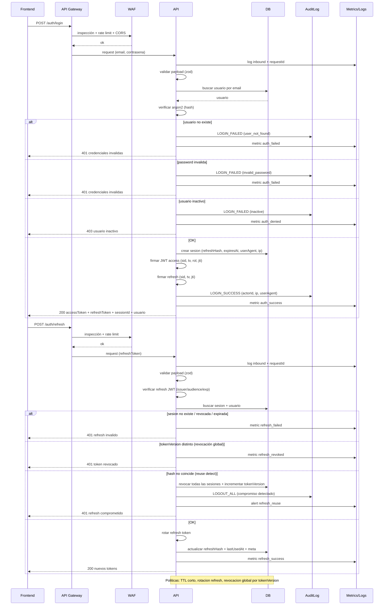
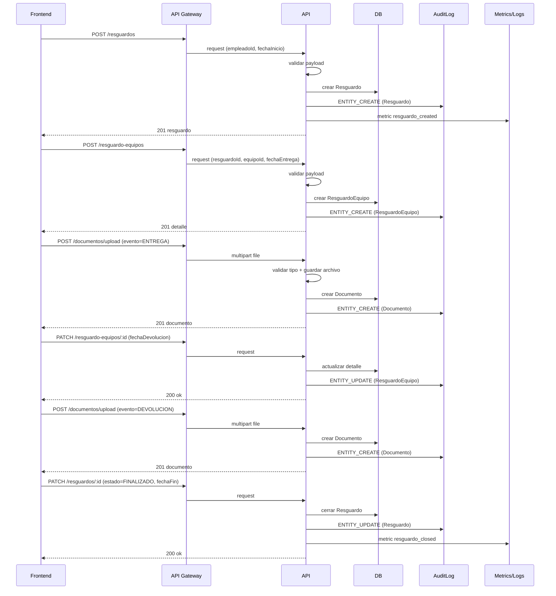
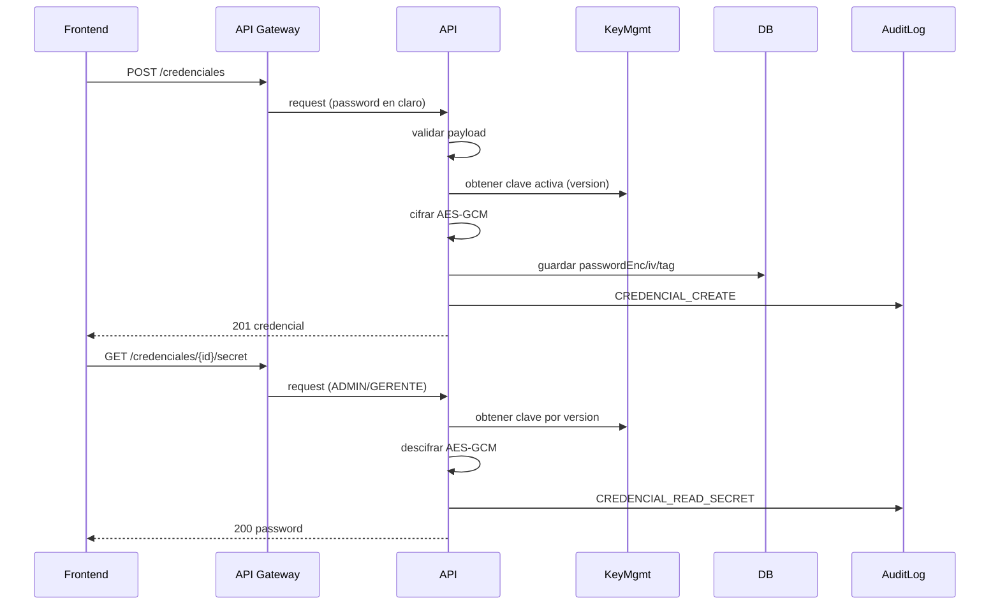
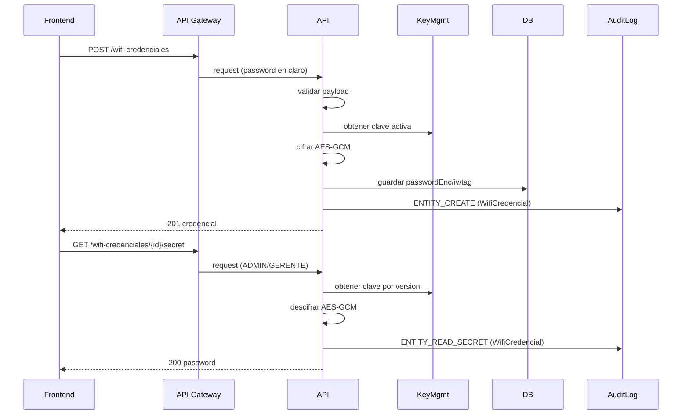
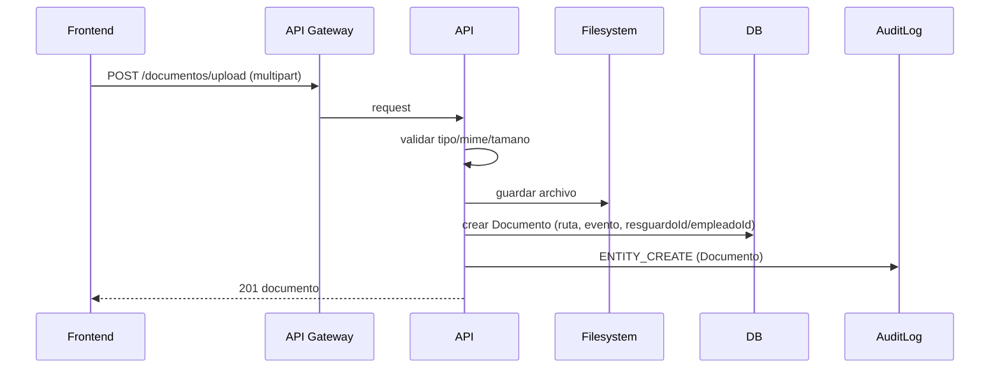

# Diagramas de Interacción (Enterprise)

> Estos diagramas están sincronizados con `docs/site/diagramas.html`.

## Login + Refresh (Enterprise+)

## Resguardo (Enterprise)

## Credenciales Web (Enterprise)

## WiFi Credenciales (Enterprise)

## Documentos (Enterprise)

